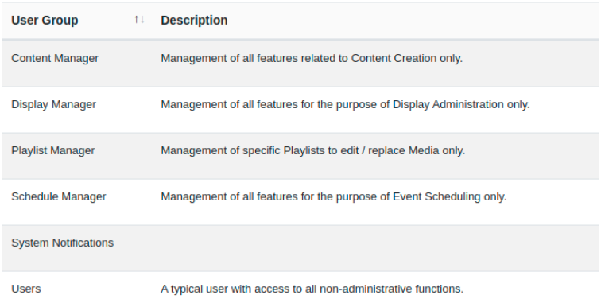

# ユーザー グループ

ユーザー グループを使用すると、特定のユーザー グループのメンバーである複数のユーザーに適用する [機能と共有](users_features_and_sharing.html) オプションを簡単に設定できます。

{tip}
ユーザー グループを使用すると、新しいユーザーのオンボーディングやシステム アクセスの管理が簡単になります。ユーザーは、グループで有効になっている機能と共有オプションを継承します。
{/tip}

独自のユーザー グループを作成するには、CMS の一般的な機能を提供するために作成された、新規インストールで使用可能な事前設定された一連のグループから選択します。

{version}
**注:** 事前設定されたユーザー グループは、新しい v4 インストールと、以前のバージョンでユーザー グループを使用したことのない v4 にアップグレードするユーザーにご利用いただけます。
{/version}

事前設定されたユーザー グループには、ユーザーが選択したロールを実行できるようにするために必要な機能がすでに有効になっています。必要に応じて、これらを変更できます。

{version}
**注:** これはスーパー管理者の高レベル機能であるため、ディスプレイ マネージャー ユーザー グループには新しいディスプレイを追加して承認する権限がありません。追加されたスーパー管理者ユーザーは、[フォルダー](https://xibosignage.com/manual/en/tour_folders#content-saving-to-folders) に新しいディスプレイを追加したり、ディスプレイ管理の目的でこのユーザー グループに [共有](https://xibosignage.com/manual/en/tour_folders#content-sharing-options) アクセス権を付与したりできます。

{/version}

## ユーザー グループの作成

ユーザー グループは、メイン CMS メニューの [**管理**] セクションの [**ユーザー グループ**] から管理されます。ユーザー グループ グリッドが開き、ユーザー グループを追加および管理できます。

{tip}

特定のニーズに合わせてユーザー グループを追加し、[新規ユーザー](users_administration.html) オンボーディング ウィザードに表示されるようにすると、最初から適切なユーザー グループにユーザーを簡単に追加できます。
ヒント}

新しいグループを追加するには、[**ユーザー グループの追加**] ボタンをクリックし、各タブに必要な情報を入力します。

#### 全般

- CMS 内でユーザー グループを識別するための **名前** を付けます
- このユーザー グループのライブラリにアップロードできる [ライブラリ クォータ](users_administration.html#content-library-quota) の最大量を入力します。クォータを適用しない場合は 0 を入力します。
- ユーザー グループが通知を受信する場合は、タイプ (**システム** または **表示**) を選択します。

#### 説明

作成したグループを説明するオプションのテキストを入力します。

{ヒント}
新しいユーザーのオンボーディングに表示するように有効にした場合、この説明 (グループの役割など) は選択しやすいように表示されます。
ヒント}

#### オンボーディング設定

このタブを使用して、新規ユーザーのオンボーディングのオプションを制御します:

- オンボーディング ウィザードを使用するときに、このユーザー グループを選択対象に含める場合はチェックを入れます。
- ドロップダウンを使用して、このグループのすべてのメンバーのホームページとして使用される [ダッシュボード](users_dashboards.html) を選択します。
- [保存] をクリックします。

### グループ メンバー

グリッドに追加したら、行メニューを使用してユーザーをユーザー グループに追加します:

- [**メンバー**] をクリックします

- 選択した **ユーザー グループ** に属する **ユーザー** を選択します。
- [保存] をクリックします。

{ヒント}
共有とコラボレーションを容易にするために、ユーザーを 1 つ以上の **ユーザー グループ** に割り当てることができます!

メンバーシップは、行メニューを使用して [ユーザー グループ] を選択し、[メンバーシップの管理] フォームを開くことで、ユーザー グリッドから制御することもできます。

ヒント}

### 機能

行メニューから [機能](users_features_and_sharing.html) を選択して、CMS の関連部分へのユーザー グループのアクセスを制御します。

### コピー

行メニューから既存のユーザー グループの **コピー** を作成し、調整して、要件に合わせて新しいグループを簡単に作成します。

#### 次へ...

[機能と共有](users_features_and_sharing)
