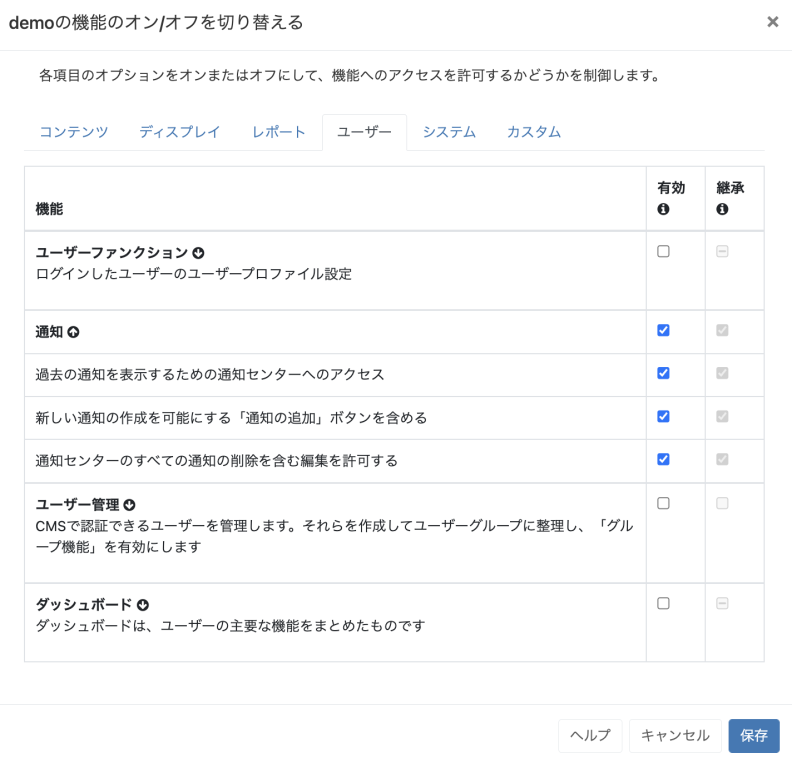
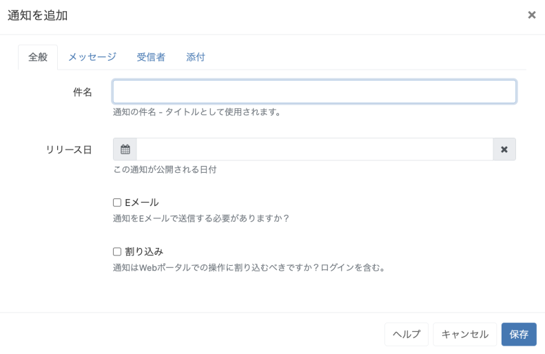

<!--toc=users-->

# 通知

[[PRODUCTNAME]]には、CMSの管理者とユーザーに重要なシステムイベントやその他のユーザーが作成した通知を知らせるための**通知システム**があり、[スケジュールイベントリマインダー](scheduling_events.html#reminders)などの機能を備えています。

{tip}
通知を使用する前に、管理者がCMS設定ページの**ネットワーク**タブで**送信メール**アドレスを入力していることを確認してください。
{/tip}

## 通知ドロワー

ログインしているユーザーの通知は画面右上に表示され、未読の通知はアラームベルのアイコンの横に赤色で表示されます。

通知ドロワーは、アラームベルのアイコンをクリックすることで表示されます。

{tip}
通知ドロワーは、適切な[機能](users_features_and_sharing.html)を有効にしたユーザー/ユーザーグループに対して表示されます。[機能]から[ユーザー]をクリックし、[通知]のオプションから適用することができます。

{/tip}

アラームベルをクリックすると、**通知ドロワー**が開き、最近受信した5つの通知が表示されます。未読の通知は黒いテキストで、既読の通知は薄いグレーのテキストで表示されます。

各通知のタイトルをクリックすると、ポップアップが表示され、通知の全文を読むことができます。

{tip}
通知は、公開日を過ぎており、ログインしているユーザーに通知が割り当てられている場合のみ、通知ドロワーに表示されます。
{/tip}

## 通知センター

通知を作成するには、通知ドロワーの下部にある**通知センター**のリンクを使用して、**通知を追加**アクションボタンをクリックします。

### 一般

- 通知の **件名** のタイトルを入力してください。

- 送信する**日付**と**時刻**を選択します。

- オプションで**Eメール**として通知を送信する場合はチェックを入れます。

  {tip}
  **受信者**タブで定義され選択されたユーザーに対して、CMSユーザーレコードに記録されたメールアドレスに通知が送信されます。
  {/tip}

- **割り込み**」オプションを使用すると、ユーザーは自動的に通知の全文を表示するページにリダイレクトされます。ユーザーは、CMSのナビゲーションを続けるために、**継続...**をクリックする必要があります。

  {tip}
  **管理**ページの**メンテナンス**タブで、**メールアラートを有効にする**が有効になっていることを確認してください。
  {/tip}

### メッセージ

- テキストエディターを使って、通知メッセージ本文を作成し、書式設定します。

  {tip}
  [通知ウィジェット](media_module_notifications.html)を使って表示/ディスプレイグループにメッセージを送る場合、ここで使用した書式は通知ウィジェットで設定した書式に置き換えられるため、使用されません。
  {/tip}

### 受信者 

- この通知を受け取る**ユーザー/ユーザーグループ**を選択します。
- CMSの**非ユーザー**で、この通知を受け取る必要がある人のEメールアドレスを入力します。
- 通知を表示する**ディスプレイ/ディスプレイグループ**を選択します。

  {tip}
  ディスプレイをターゲットにするには、レイアウトがすでにスケジュールに入っていて、[通知ウィジェット](media_module_notifications.html)を含んでいる必要があります。
  {/tip}

### 添付

- ファイルをアップロードして、**通知に添付する**。

  {tip}
  添付ファイルは、**通知センター**からダウンロードすることもできます。
  {/tip}

## 通知の編集

通知の編集はCMSウェブポータルで変更されますが、すでに送信されたメールは呼び戻されません。

## システム通知

[PRODUCTNAME]]は、システム全体の健全性を報告するために、さまざまな**システム通知**を発生させます。通知は、**ネットワーク**タブの**設定**で設定された**管理者**Eメールアドレスに送信されます。

システム通知を受信するように設定されたグループに属するユーザー、またはシステム通知を受信するように設定されたユーザーにも通知が送られます。この設定は、[ユーザー/ユーザーグループを編集]フォームで管理されます。

