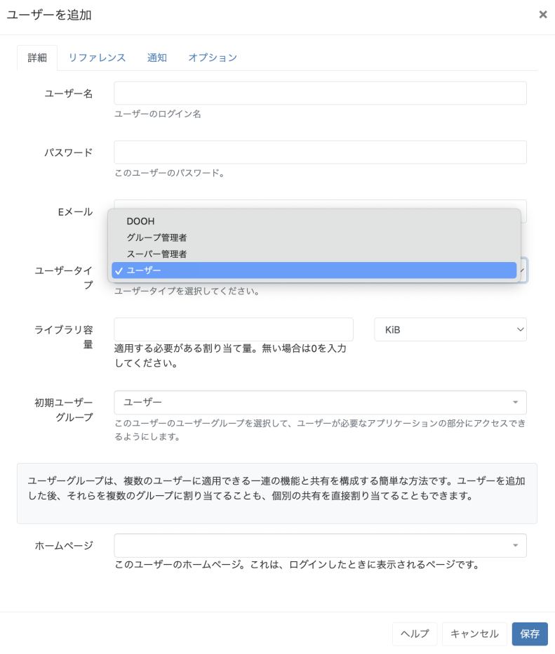

<!--toc=users-->

# ユーザータイプ

すべてのユーザーには、主に3つのユーザータイプのうち1つが割り当てられます。

- **スーパー管理者**
- **グループ管理者**
- **ユーザー**

さらに、API経由でのみCMSへのアクセスを許可される **DOOH**ユーザータイプがあります。[DOOHアプリケーション](users_administration.html#マイアプリケーション)と共に使用します。

  

{tip}

ユーザータイプはあらかじめ設定されており、変更することはできません。

{/tip}

## スーパー管理者

スーパー管理者は、他のユーザーが追加したメディア、レイアウト、スケジュールを含むCMSの**すべて**にアクセスすることができます。
スーパー管理者は、ユーザーグループに設定されている権限に関係なく、CMS全体にアクセスすることができます。

{tip}

インストール時に **スーパー管理者**は作成され、CMS 全体にアクセスすることができます。
CMSシステムの最後のコンタクトポイントとして、少なくとも1人のスーパー管理者を持つことをお勧めします。

{/tip}  

## グループ管理者 

グループ管理者は、所属するユーザーグループに割り当てられたCMSの部分へのアクセス権のみを持ちます。また、自分のメディア、レイアウト、スケジュールだけでなく、そのユーザーグループに所属する他のすべてのユーザーのメディア、レイアウト、スケジュールにもアクセスすることができます。

## ユーザー

ユーザーは、所属するユーザーグループに割り当てられたCMSの機能と、ユーザー自身のメディア、レイアウト、スケジュールへのアクセス権のみを持ちます。

### DOOH

DOOHユーザーは、APIを通じてCMSにアクセスし、コンテンツの作成とスケジューリングを行うことができ、自分に属するディスプレイ／メディア／プレイリスト／レイアウトのみを見ることができます。DOOHユーザーが作成したコンテンツは、DOOHユーザー以外のユーザーには見えません。

**スーパー管理者**はユーザープロファイル(tour_user_profile.html)で、DOOHユーザーのコンテンツを閲覧する際の優先順位を設定できます。

{tip}
ユーザータイプは、最初にユーザーを追加する際に選択し、個々のユーザーレコードから編集することができます。
{/tip}
